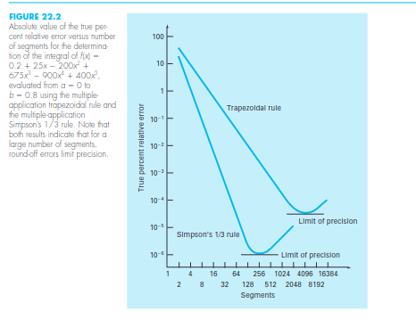

# Installation

## Prerequisites

### Linux

```bash
sudo apt-get update
sudo apt-get install cmake
sudo apt-get install g++
```

### Mac
```bash
/bin/bash -c "$(curl -fsSL https://raw.githubusercontent.com/Homebrew/install/HEAD/install.sh)"
brew install cmake
xcode-select --install
```

### Windows
To install CMake on Windows, download the installer from the CMake Downloads page and follow the installation instructions.
g++ (MinGW)

g++ can be installed on Windows using MinGW.

- Download MinGW from https://sourceforge.net/projects/mingw/.
- Install MinGW, and during the installation, make sure to select the mingw32-gcc-g++ package.
- Add the MinGW bin directory (usually C:\MinGW\bin) to your system's PATH environment variable.


## Build and Run
```bash
git clone https://github.com/charles-victorio/Numerical-Integration.git
cd Numerical-Integration
```
If you are comfortable with bash call ```chmod +x tools/*.sh ``` once.

For each run call:

```bash
tools/build_and_run.sh
```

Or you may prefer:
```bash
cd build
make
./numerical_integration
```

# What to do now

It's science time.
Independent variables: Which algorithm, which parameters for each algorithm, which function (some functions have properties which make them harder to integrate than others, like being improper, having discontinuities within them, etc)
Dependent variables: Accuracy, time, number of instructions (number of function evaluations, number of "iterations" of the algorithm, etc. depends on which algorithm)
The goal is to find which algorithms are better in which situations.



There may be optimizations from programming (ie not math) to improve speed and numerical stability.

More code should be added to make it easier to analyze, like by making graphs like those above above, for many methods/parameters/functions with a few lines of code.

Make adaptive versions of the algorithms when applicable. (not a super high priority)
The user will only need to set absolute and relative tolerances for the error level and the computer will work until it gets an answer to the desired level of accuracy.
This will make it easier to test. The report class will store the cost and error datapoints to make a graph

Algorithms left to implement (not a super high priority):
- Newton Cotes methods that are higher order than Simpson's 1/3rd
- Gaussian quadrature with arbitrary n (will need to calculate x and w values)
- Clenshaw–Curtis quadrature with Discrete Cosine Transform for O(n lg n) performance