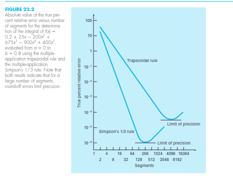

# How to Use

In one line:

```python
print(Integral(lambda x: 2 * x, 0, 10).integrate_with(Trapezoid(1000)))
```

A lambda function in python just helps us write a function in one line.

To analyze the accuracy and cost of multiple algorithms on the same function, create an Integrator() object, set the strategy and it's parameters, and keep track of the computed results. See performance_graphs.py.

The Integral class stores the basic data for the integral,
classes which inherit from Strategy are different algorithms for numeric integration,
the report class stores the data that we want to keep track of for the performance of the integration,
and the Integrator() class is where the integration is executed.

# What to do now

It's science time.
Independent variables: Which algorithm, which parameters for each algorithm, which function (some functions have properties which make them harder to integrate than others, like being improper, having discontinuities within them, etc)
Dependent variables: Accuracy, time, number of instructions (number of function evaluations, number of "iterations" of the algorithm, etc. depends on which algorithm)
The goal is to find which algorithms are better in which situations.



There may be optimizations from programming (ie not math) to improve speed and numerical stability.

More code should be added to make it easier to analyze, like by making graphs like those above above, for many methods/parameters/functions with a few lines of code.

Make adaptive versions of the algorithms when applicable. (not a super high priority)
The user will only need to set absolute and relative tolerances for the error level and the computer will work until it gets an answer to the desired level of accuracy.
This will make it easier to test. The report class will store the cost and error datapoints to make a graph

Algorithms left to implement (not a super high priority):
- Newton Cotes methods that are higher order than Simpson's 1/3rd
- Gaussian quadrature with arbitrary n (will need to calculate x and w values)
- Clenshaw–Curtis quadrature with Discrete Cosine Transform for O(n lg n) performance